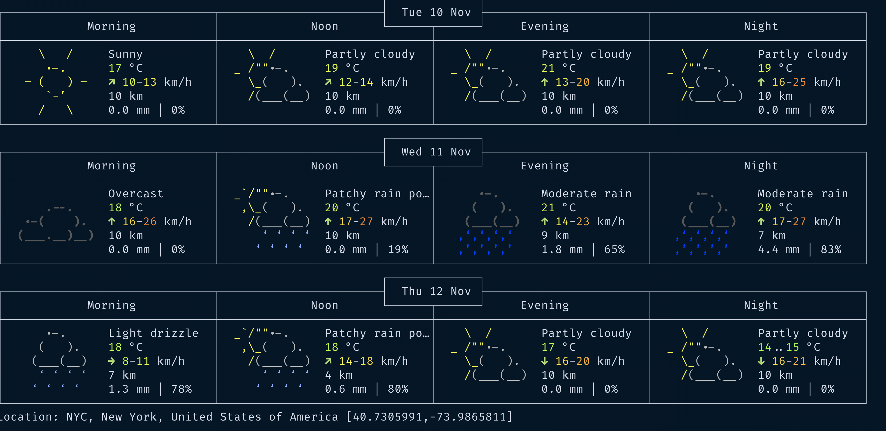

# Bash With Marcell 😎λ👩🏻‍💻

## Table of Contents

- [About](#about)
- [Change Directory](#change-dir)
- [View files](#cat)
- [Deleting/Creating](#delete-create)
- [Move/copy](#move-copy)
- [Find file/folder](#find-file-folder)
- [Grep](#grep)
- [Curl](#curl)
- [Command Line Arguments](#cmd-arg)
  <!-- - [Function](#fn) -->
  <hr/>

## About <a name = "about"></a>

This is a simple tutorial on how you can be more comfortable with using bash and be more productive as a developer. Even if you using ZSH or Fish most of this scripts will still work for you. If you using _powershell_ on Windows then sorry that would be another tutorial.

Bash is a powerful tool and has been around since 1989. Bash is available on many different OS ans Mac-os is one of them. It is the default Shell for Linux operative system.
I will write about:

- creating, moving, deleting and copying files 🤟🏻
- finding files and different text patterns 🧘🏻‍♂️
- interacting with your filesystem 🗄
- Language syntax like conditionals and variables 🈚️
- creating and running different scripts ℬ

### Prerequisites

Bash or any other unix shell like [Zsh](https://en.wikipedia.org/wiki/Z_shell) ore [Fish](https://fishshell.com/).

## [Navigate the file system](https://swcarpentry.github.io/shell-novice/02-filedir/index.html)

#### [egghead.io](https://egghead.io/courses/automate-daily-development-tasks-with-bash).

## Change bash's current working directory <a name = "change-dir"></a>

```bash
$ cd <file path goes here>
# to go up a directory from your current directory
$ cd ..
```

#### List a directory's contents

```bash
$ ls
   to get more information add the -l flag

$ ls -l

this will output -rw-r--r--


what it means is :
permission for you, your group, all number of links (hardlinks & softlinks)

owner user
owner group
file size
last modified time
file name

to see the hidden folders add on the -a flag

the  dash before r means it's a file !


ls -a
 Can been combined with -l as well
ls -la

```

<hr/>

## Check content in a file , for example checking your dependencies in package.json <a name = "cat"> </a>

```bash
$ cat <file name>
# shows it with line numbers
# 1.
# 2.
# ...
$ cat -n <file name>
```

```bash
  # view the file without dumping it all onto your screen
$ less <file name>
# Some useful shortcuts in less
#   Shift+g   (jump to end)
#   g         (go back to top)
#   /         (search)
#   q         (quit/close)
```

<hr/>

## Remove/delete files <a name = "delete-create"> </a>

echo work like _console.log_ in javascript, it will just print the string in your console.

```bash
  $ echo 'hello'
```

we can simple generate some randomtext in a file like this

```bash
  $ echo "hello there master" > text.txt
```

now to see what is in the current directory

```zsh
  $ ls
  style.css app.js main.rs text.txt
```

bash automatically created a file for us

```bash
  $ cat text.txt

  # prints : hello there master
```

to overide the text you simple type same thing with another value like:

```bash
  $ echo "12345 is some cool number" >  text.txt
```

to concat text value we simply add another > symbol

```bash
  $ echo "I don't want to overide the text this time" >> text.text
```

create directory with bash we use the _mkdir_

```bash
  $ mkdir <directory name>
```

to create some subfoldres that don't exists we can add the _-p_ flag.

```bash
  $ mkdir /a/b/c/d
```

will give os the folder structure of

```zsh
  --a
    --b
      --c
        --d
```

to remove a directory we need to use the rm -r (-r) = recursive
Sometimes you will see the **-rf flag** , recursive force.
I highly don't recommend to use it if you don't know what you are doing.

```bash
 $ rm -r folder/
 $ rm -rf folder/
```

<hr/>

## move and copy <a name = "move-copy"> </a>

Move comand (mv) comand allows us to move folders/files.

we want to move index.js in folder b

```bash
  # we have in folder a
  index.js style.css

 $ mv index.js ../b

 $ ls b
  # index.js ...and some other files

```

to copy a file we use the **cp** comand.
For example cp file.txt src/file.txt
we copy file.txt into src with the same file name.

```bash
 $ cp README.md src/README.md
```

We can evenly copy everyting in a folder recursively using the -R flag

```bash
 $ cp -R src/* anotherFolder/
```

<hr/>

## Find files and folders <a name = "find-file-folder"> </a>

Let's say we have a working folder with diffrent files.
We want to find all the typescript files.

```bash
 $ ls src
  # app.js app.ts index.js index.ts style.css index.html
```

```bash
 $ find src/ -name "*.ts"
```

will give us all the typescript files.

We can even add some extra flags for a more specific search

```bash
  find images/ -iname "*.png"
```

will match both PNG and png because the i flag is a case sensitive flag.

You can even find folders through

```bash
$ find . -type d

.
./src
./helpers

$ find . -type d -name "icons"
./icons

find src -type d
src
src/middleware
src/config
src/utils
src/models
src/__tests__
src/controllers
src/routes

```

<hr/>

## Grep <a name = "grep"> </a>

Grep works the same as find byt the difference is that is searches by a pattern. Grep is vey powerful and you can configure it with dfferent flags to get different outputs.

```bash
 $ grep "let" client/*
```

Will print out a lot of let declaration in our client folder.

- client/record.js: let record = xs[0]
- client/record.js: let recordCount = 0
- client/record.js: let decreaseCount = 0
- client/record.js: for (let i = 0; i < xs.length; i++) {
- client/record.js: for (let i = 0; i < xs.length; i++) {
- client/record.js:let list = [10, 5, 20, 20, 4, 5, 2, 25, 1]
- ...and much more

To be more specific we can adn some flags to it.

```bash
  $ grep --color -n  "let" client/*
```

color will highlight the pattern and -n will give us on what row we can find the our pattern.

<hr/>

## Curl <a name = "curl"> </a>

Curl is how you can make `HTTP` request from your shell.
A great tool for testing your endpoints, both retrieving data and doing `post` requests.

For example, curl as an HTTP client can send a request to view or download content (GET request) or to send content via a form on a website (POST request). Many web applications and services allow curl to interact with its Application Programming Interface (APIs).

For example retrieve the weather with ` curl http://wttr.in/location`

```zsh
  $ curl http://wttr.in/newyork
```



### Get files

using the **starwars** api
we can add a lot of different flags on our request, including data, headers, tokens etc.
I recomend to go through the documentation of `curl` if you are intrested [curl](https://curl.se/docs/manual.html)

```bash
  $ curl https://swapi.co/api/people/1/
  $ curl -i https://swapi.co/api/people/1/
```

the **-i** will give us the headers as well, stands for include.

```http
HTTP/2 404
date: Tue, 10 Nov 2020 12:24:24 GMT
content-type: text/html; charset=utf-8
set-cookie: __cfduid=dfa086f1f75244512be58ec2171024d811605011064; expires=Thu, 10-Dec-20 12:24:24 GMT; path=/; domain=.swapi.co; HttpOnly; SameSite=Lax; Secure
cache-control: no-cache, no-store
cf-cache-status: DYNAMIC
cf-request-id: 0653b65cd60000d14b542e6000000001
expect-ct: max-age=604800, report-uri="https://report-uri.cloudflare.com/cdn-cgi/beacon/expect-ct"
report-to: {"endpoints":[{"url":"https:\/\/a.nel.cloudflare.com\/report?s=0E0ijimbSl%2B1s8wLqeauH5lS8Mw9t98h%2FyNqfRMZ%2Fara%2FDw3MrXXrJVJ9IbVJR3siHuLBN3Kx1XAJ3H1acFtd%2Fx81Rk6RfqFEg%3D%3D"}],"group":"cf-nel","max_age":604800}
nel: {"report_to":"cf-nel","max_age":604800}
server: cloudflare
cf-ray: 5effc00e29acd14b-GOT
```

```bash
  $ curl -iL https://swapi.co/api/people/2
```

the _L_ flag will tell to follow redirects

To add headers to out request we simple add the `-H` flag.

```bash
 $ curl -H "Authorization: Bearer some-token" localhost:5000/api/pokemons
```

with using the `-X` flag we can even do `POST`` requests.

```bash
 curl -X POST "Content-Type: application/json" -d '{"id":12, "name":"Zlatan"}'  https://jsonplaceholder.typicode.com/users
```

## Command Line Arguments <a name = "cmd-arg"> </a>

You can run `Command line arguments` with your shell. Start creating a file script.sh.

```bash
  $ touch script.sh

```

edit the content in `script.sh`

```bash
  $ echo "Hello there"
```

and try to execute your script file ./script.sh.  
You will probably get a `zsh/bash: permission denied: ./script.sh`

thats because we don't have the permission to execute our script, the check what your permissions are, you can simply run. `ls -l`.
You will get something like this:

```bash
  -rw-r--r--  1 marcis  staff     9371 Nov 15 11:56 README.md
  -rw-r--r--  1 marcis  staff      600 Nov  9 12:54 a.md
  -rw-r--r--@ 1 marcis  staff  1383257 Nov 10 13:15 ex.png
  -rwxr-xr-x  1 marcis  staff       75 Nov  9 12:54 func.sh
  -rw-r--r--  1 marcis  staff       11 Nov  9 12:54 hello.txt
  -rw-r--r--  1 marcis  staff       19 Nov 15 12:00 script.sh
```

you can se that we have permission to read and write but not to execute.
To give permission to our file we can simply run.

```bash
  $ chmod u+x script.sh
```

now when we run `ls -a` we will have a smaller change

```bash
  -rwxr--r--  1 marcis  staff       19 Nov 15 12:00 script.sh
```

we have now the permission to execute our script.
Try to run ./script.sh, should print out `Hello there`

Let's make it more dynamic and some variables to the script file.
in `script.sh`:

```bash
  echo "Welcome, enter your name"
  echo "Hello there $1"
```

the dollar sign is a variable.

```bash
now run script.sh. "Your name"

Hello `Your name`
```

<!-- ## [Functions in bash](https://devhints.io/bash) -->

<!-- ## simple Functions <a name = "fn"> </a>

```bash
  get_team(){
    echo "Legia"
  }

  echo "My team is $(get_team)"

  get_name(){
  echo $1
}

  greet=$(get_name "Marcell")

  echo "Hello $greet ""
```

## Making HTTP requests with CURL <a name ="curl"> </a>

##### Curl Post request with no data

```curl
  curl -X POST http://URL//example.com
```

##### Curl Post request with data

```curl
  curl -d "data=example1&data2=example2" http://UTL/example.com
```

##### Curl Post request with data to a Form

```curl
  curl -X POST -F "name=user" -F "password=123456" http://URL/example.com
```

##### Curl Post request with a file

```curl
  curl -X POST -F "image=@/path/example.gif" http://URL/uploadform.cgi
``` -->
